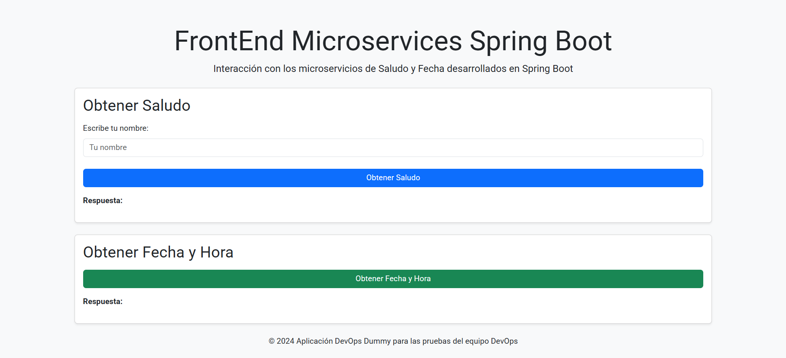

# **DEVOPS DUMMY - SUBPAGE**
# **SPRINGBOOT - MAVEN**

## Descripción del proyecto
Este proyecto dummy consiste en un FrontEnd contenerizado desarrollada en `Java` usando las herramientas `Springboot` y `Maven`, sus pruebas unitarias fueron desarrolladas utilizando `JUnit 5`, `Mockito` y `Spring Boot Test`.

## Funcionamiento
Este proyecto funciona con dos funcionalidades para ser usadas por el usuario, en la primera funcionalidadel usuario obtiene un saludo personalizado si ingresa el nombre o solo hola mundo si no lo ingresa, en la segunda el usuario pude obtener la fecha del sistema en el momento. 



## Objetivo
El objetivo principal de este proyecto es proporcionar un proyecto de prueba para el equipo DevOps. Se utiliza para realizar pruebas de los pipelines de CI/CD desarrollados en el repositorio `devops-pipeline-cicd`. 

Los pasos del pipeline incluyen:

- Compilación de código.
- Ejecución de pruebas unitarias.
- Despliegue de imágenes a Azure Container Registry.
- Despliegue de la aplicación en OpenShift preproductivo y productivo en el namespace `devopsdummy`.

---

## **Implementación en local de la aplicación Dummy**
Para desplegar localmente la aplicación Dummy, se pueden seguir dos métodos: sin Docker o con Docker.

### **Opción 1: Instalación sin Docker**
#### **Tecnologías necesarias**
- JDK (Java 8 o superior)
- Maven
- git

#### **Pasos de instalación y ejecución**
1. Clonar el repositorio:
   ```sh
   git clone https://AlcaldiaMedellin@dev.azure.com/AlcaldiaMedellin/DevOps%20Dummy/_git/devopsdummy-springboot-subpage-mfe-frontend
   ```
2. Ingresar a la carpeta raíz del proyecto:
   ```sh
   cd devopsdummy-springboot-subpage-mfe-frontend
   ```
3. Compilar y empaquetar el proyecto:
   ```sh
   mvn clean install
   ```
4. Ejecutar la aplicación:
   ```sh
   java -jar target/springbootmfe-0.0.1-SNAPSHOT.jar
   ```
5. Acceder a la aplicación en el navegador: [http://localhost:8080](http://localhost:8080)

6. (Opcional) Ejecutar pruebas unitarias:
   ```sh
   mvn test
   ```
7. (Opcional) Ejecutar pruebas unitarias con cobertura:
   ```sh
   mvn test jacoco:report
   ```

---

### **Opción 2: Instalación con Docker**
#### **Tecnologías necesarias**
- Docker Desktop
- git

#### **Pasos de instalación y ejecución**
1. Clonar el repositorio:
   ```sh
   git clone https://AlcaldiaMedellin@dev.azure.com/AlcaldiaMedellin/DevOps%20Dummy/_git/devopsdummy-springboot-subpage-mfe-frontend
   ```
2. Ingresar a la carpeta raíz del proyecto:
   ```sh
   cd devopsdummy-springboot-subpage-mfe-frontend
   ```
4. Construir la imagen Docker:
   ```sh
   docker build -t devopsdummyspringbootmfe:1 .
   ```
5. Ejecutar el contenedor:
   ```sh
   docker run -p 8080:8080 devopsdummyspringbootmfe:1
   ```
6. Acceder a la aplicación en el navegador: [http://localhost:8080](http://localhost:8080)

---

## **Levantamiento del Backend**
Para levantar el backend de la aplicación es necesario clonar el [repositorio del Backend Saludo](https://AlcaldiaMedellin@dev.azure.com/AlcaldiaMedellin/DevOps%20Dummy/_git/devopsdummy-springboot-saludo-ms-backend) y [repositorio del Backend Fecha](https://AlcaldiaMedellin@dev.azure.com/AlcaldiaMedellin/DevOps%20Dummy/_git/devopsdummy-springboot-fecha-ms-backend), y seguir los pasos descritos en su README.md.

**NOTA:** Ten en cuenta que el proyecto se conecta a Openshift pero se puede levantar los microservicios y cambiar el apuntamiento en el src\main\java\com\devopsdummy\springbootmfe\controller\frontend.java

---
